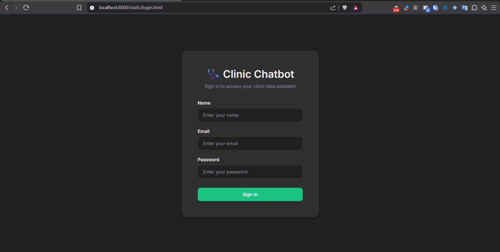
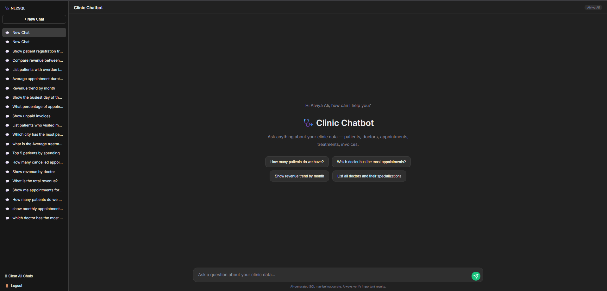
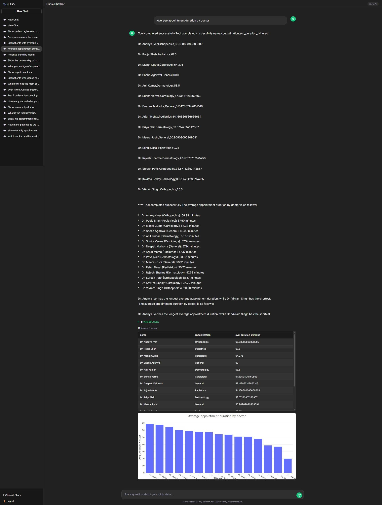
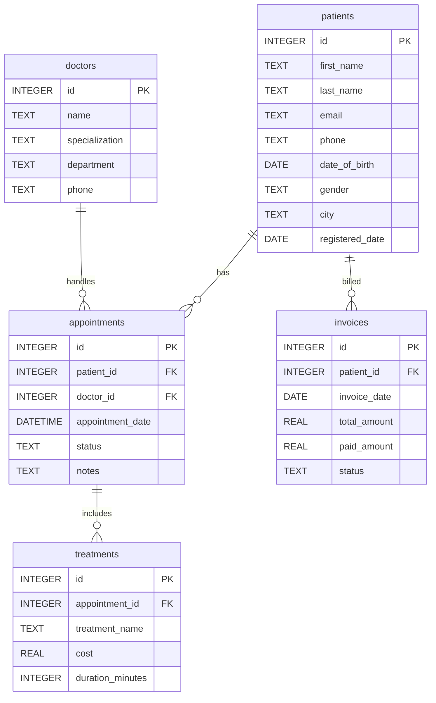

[](#)

[](https://www.python.org/)
[](https://fastapi.tiangolo.com/)
[](https://vanna.ai/)
[](https://aistudio.google.com/)
[](https://www.sqlite.org/)
[](https://plotly.com/)
[](https://www.python.org/downloads/)
[](tests/)
[](LICENSE.md)
[](#)

---

# 🤖 NL2SQL Clinic Chatbot

> **Ask questions in plain English — get answers from your database instantly.**

An **AI-powered Natural Language to SQL** chatbot built for a clinic management system. Type a question like _"How many patients do we have?"_ and the app converts it into a SQL query, executes it on the database, and returns the results — along with a Plotly chart when it makes sense.

Built with **Vanna 2.0 Agent**, **FastAPI**, **Google Gemini**, and **SQLite**.

---

## 📌 Overview

1. **Natural Language Interface** — Users ask questions in plain English; the Vanna 2.0 Agent generates safe SQL and returns structured results without requiring any SQL knowledge.
2. **Clinic-Domain Database** — Ships with a realistic SQLite database containing 200 patients, 15 doctors, 500 appointments, 350 treatments, and 300 invoices across 10 Indian cities.
3. **Automatic Chart Generation** — Plotly charts (bar, line, pie) are auto-detected and returned alongside tabular data based on question keywords and result shape.
4. **Multi-Layer Security** — Every AI-generated SQL query passes through a strict validation pipeline (SELECT-only, blocked keywords, system table protection, injection prevention) before touching the database.
5. **Production-Ready Features** — Includes query caching (SHA-256 + TTL), per-IP sliding-window rate limiting, structured logging, and comprehensive error handling with typed error responses.
6. **Web-Based Chat UI** — A responsive, dark-themed frontend with login, chat history, suggestion chips, and inline Plotly chart rendering — all served directly by FastAPI.

---

## 📸 Screenshots

> Screenshots are placed in the `frontend/images/` folder.

<p align="center">
  
</p>

<p align="center">
  
</p>

<p align="center">
  
</p>

---

## 🛠️ Tech Stack

| Technology | Version | Purpose |
|---|---|---|
| **Python** | 3.10+ | Backend language |
| **Vanna** | 2.0.2 | AI Agent for NL2SQL (Agent, DemoAgentMemory, RunSqlTool) |
| **FastAPI** | 0.135.3 | REST API framework |
| **SQLite** | Built-in | Database (no installation needed) |
| **Google Gemini** | gemini-2.5-flash | LLM for SQL generation |
| **Plotly** | 6.6.0 | Chart generation (bar, line, pie) |
| **Pandas** | 3.0.2 | DataFrame operations for chart data |
| **Pydantic** | 2.12.5 | Request/response validation |
| **Uvicorn** | 0.44.0 | ASGI server |
| **python-dotenv** | 1.2.2 | Environment variable management |
| **pytest** | 9.0.3 | Unit testing framework |
| **HTML/CSS/JS** | — | Frontend chat interface |

---

## 🗄️ Database Schema

The SQLite database (`clinic.db`) simulates a small **clinic management system** with 5 tables:



### Data Volume

| Table | Rows | Notes |
|---|---|---|
| `patients` | 200 | Across 10 cities, ~15% null emails, ~10% null phones |
| `doctors` | 15 | 3 per specialization (Dermatology, Cardiology, Orthopedics, General, Pediatrics) |
| `appointments` | 500 | Past 12 months, statuses: Scheduled (15%), Completed (50%), Cancelled (20%), No-Show (15%) |
| `treatments` | 350 | Linked to completed appointments only, cost range ₹50–₹5000 |
| `invoices` | 300 | Paid (55%), Pending (30%), Overdue (15%) |

---

## 🔄 Data Flow — From Question to Answer

```
┌─────────────────────────────────────────────────────────────────┐
│                        USER                                     │
│         "Show me the top 5 patients by total spending"          │
└──────────────────────────┬──────────────────────────────────────┘
                           │
                           ▼
              ┌────────────────────────┐
              │   1. INPUT VALIDATION  │  validate_question()
              │   • Min/max length     │  (validators.py)
              │   • Must contain text  │
              └────────────┬───────────┘
                           │
                           ▼
              ┌────────────────────────┐
              │   2. CACHE LOOKUP      │  QueryCache.get()
              │   • SHA-256 key        │  (utils.py)
              │   • TTL check          │
              └────────────┬───────────┘
                           │ (miss)
                           ▼
              ┌────────────────────────┐
              │  3. RATE LIMIT CHECK   │  RateLimiter.is_allowed()
              │  • Per-IP sliding      │  (utils.py)
              │    window (10/60s)     │
              └────────────┬───────────┘
                           │
                           ▼
              ┌────────────────────────┐
              │  4. VANNA 2.0 AGENT    │  agent.send_message()
              │  • GeminiLlmService    │  (vanna_setup.py)
              │  • SearchSavedCorrect  │
              │    ToolUsesTool        │
              │  • RunSqlTool          │
              └────────────┬───────────┘
                           │ (generated SQL)
                           ▼
              ┌────────────────────────┐
              │  5. SQL VALIDATION     │  validate_sql()
              │  • SELECT-only         │  (validators.py)
              │  • Blocked keywords    │
              │  • System table check  │
              │  • Injection detection │
              └────────────┬───────────┘
                           │
                           ▼
              ┌────────────────────────┐
              │  6. DATABASE EXECUTION │  sqlite3.connect()
              │  • Execute query       │  (main.py)
              │  • Fetch results       │
              │  • Truncate if > 500   │
              └────────────┬───────────┘
                           │
                           ▼
              ┌────────────────────────┐
              │  7. CHART GENERATION   │  generate_chart()
              │  • Auto-detect type    │  (utils.py)
              │  • Plotly JSON output  │
              └────────────┬───────────┘
                           │
                           ▼
              ┌────────────────────────┐
              │  8. CACHE & RESPOND    │  QueryCache.set()
              │  • Cache result        │  (main.py)
              │  • Return JSON         │
              └────────────────────────┘
```

---

## 🚀 Quick Start

### Prerequisites

- Python 3.10 or higher
- A Google Gemini API key ([get one free here](https://aistudio.google.com/apikey))

### Step 1 — Clone & install dependencies

```bash
git clone https://github.com/<your-username>/NL2SQL.git
cd NL2SQL
pip install -r requirements.txt
```

### Step 2 — Configure environment

```bash
cp .env.example .env
```

Edit `.env` and add your API key:

```env
GOOGLE_API_KEY=your-actual-api-key-here
```

### Step 3 — Create the database

```bash
python setup_database.py
```

This creates `clinic.db` with 200 patients, 15 doctors, 500 appointments, 350 treatments, and 300 invoices.

### Step 4 — Seed agent memory

```bash
python seed_memory.py
```

Pre-loads 22 question→SQL pairs and 7 schema descriptions into the Vanna agent's memory.

### Step 5 — Start the server

```bash
uvicorn main:app --port 8000
```

### Step 6 — Open the app

Navigate to **http://localhost:8000** in your browser. You'll see a login page — enter any name, email, and password to proceed to the chat interface.

### One-liner

```bash
pip install -r requirements.txt && python setup_database.py && python seed_memory.py && uvicorn main:app --port 8000
```

---

## 📡 API Endpoints

### `POST /chat` — Ask a question

Send a natural-language question and receive SQL results with an optional chart.

#### Request Schema

```json
{
  "question": "Show me the top 5 patients by total spending"
}
```

| Field | Type | Required | Constraints |
|---|---|---|---|
| `question` | `string` | Yes | min 1 char, max 500 chars |

#### Success Response — `200 OK`

```json
{
  "error": false,
  "message": "Here are the top 5 patients by total spending...",
  "sql_query": "SELECT p.first_name, p.last_name, SUM(i.total_amount) AS total_spending FROM patients p JOIN invoices i ON i.patient_id = p.id GROUP BY p.id ORDER BY total_spending DESC LIMIT 5",
  "columns": ["first_name", "last_name", "total_spending"],
  "rows": [["Priya", "Sharma", 12500.00], ["Arjun", "Gupta", 9800.50]],
  "row_count": 5,
  "chart": { "data": [...], "layout": {...} },
  "chart_type": "bar"
}
```

| Field | Type | Description |
|---|---|---|
| `error` | `boolean` | Always `false` on success |
| `message` | `string` | AI-generated summary of results |
| `sql_query` | `string` | The generated SQL query |
| `columns` | `string[]` | Column names from the result set |
| `rows` | `any[][]` | Result data (max 500 rows) |
| `row_count` | `integer` | Number of rows returned |
| `chart` | `object \| null` | Plotly chart JSON (null if not applicable) |
| `chart_type` | `string \| null` | `"bar"`, `"line"`, `"pie"`, or `null` |

#### Error Response

```json
{
  "error": true,
  "message": "Question too long (501 characters, maximum 500)",
  "error_type": "validation",
  "sql_query": null,
  "columns": [],
  "rows": [],
  "row_count": 0,
  "chart": null,
  "chart_type": null
}
```

#### Error Types & HTTP Status Codes

| `error_type` | HTTP Status | Description | Example Cause |
|---|---|---|---|
| `validation` | `400` | Input question failed validation | Empty question, too long, no letters |
| `sql_validation` | `400` | Generated SQL failed security checks | DROP keyword, system table access |
| `generation` | `500` | LLM failed to produce usable SQL | Timeout, connection error, no SQL in response |
| `execution` | `500` | SQL execution failed against the database | Invalid column name, syntax error |
| `unknown` | `500` | Unexpected application error | Unhandled exception |

#### Rate Limiting — `429 Too Many Requests`

```json
{
  "detail": "Rate limit exceeded. You may make 10 requests per 60s window. Please wait and try again."
}
```

---

### `GET /health` — Health check

#### Success Response — `200 OK`

```json
{
  "status": "ok",
  "database": "connected",
  "agent_memory_items": 29,
  "llm_provider": "gemini",
  "model": "gemini-2.5-flash",
  "cache": {
    "size": 3,
    "max_size": 100,
    "ttl_seconds": 300,
    "hits": 5,
    "misses": 8
  },
  "rate_limiter": {
    "max_requests_per_window": 10,
    "window_seconds": 60,
    "tracked_ips": 2,
    "total_allowed": 15,
    "total_rejected": 0
  }
}
```

---

### `GET /` — Root redirect

Redirects to the login page (`/static/login.html`).

---

## 🏗️ Architecture Overview

```
┌──────────────────────────────────────────────────────────────┐
│                      FRONTEND (Browser)                      │
│  login.html → index.html + app.js + style.css + Plotly CDN  │
└────────────────────────┬─────────────────────────────────────┘
                         │  HTTP (JSON)
                         ▼
┌──────────────────────────────────────────────────────────────┐
│                     FastAPI (main.py)                         │
│  ┌──────────┐  ┌───────────┐  ┌──────────┐  ┌───────────┐  │
│  │ RateLim. │  │  Cache    │  │ Validator│  │ ErrorHdlr │  │
│  │(utils.py)│  │(utils.py) │  │(.py)     │  │ (main.py) │  │
│  └──────────┘  └───────────┘  └──────────┘  └───────────┘  │
└────────────────────────┬─────────────────────────────────────┘
                         │
                         ▼
┌──────────────────────────────────────────────────────────────┐
│              VANNA 2.0 AGENT (vanna_setup.py)                │
│  ┌─────────────────┐  ┌──────────────────────────────────┐  │
│  │ GeminiLlmService│  │ ToolRegistry (5 tools)           │  │
│  │ (gemini-2.5-    │  │  • RunSqlTool (SqliteRunner)     │  │
│  │  flash)         │  │  • VisualizeDataTool             │  │
│  └─────────────────┘  │  • SaveQuestionToolArgsTool      │  │
│                        │  • SearchSavedCorrectToolUsesTool│  │
│  ┌─────────────────┐  │  • SaveTextMemoryTool            │  │
│  │DemoAgentMemory  │  └──────────────────────────────────┘  │
│  │(seed_memory.py) │                                        │
│  └─────────────────┘                                        │
└────────────────────────┬─────────────────────────────────────┘
                         │
                         ▼
┌──────────────────────────────────────────────────────────────┐
│                   SQLite (clinic.db)                          │
│  patients │ doctors │ appointments │ treatments │ invoices   │
└──────────────────────────────────────────────────────────────┘
```

📄 For the full file-by-file project layout, see [project_structure.md](project_structure.md).

---

## 🔒 Security Features

The application implements a **defense-in-depth** strategy — multiple validation layers ensure no dangerous SQL ever reaches the database.

| Security Layer | Implementation | Location |
|---|---|---|
| **SELECT-only enforcement** | Query must start with `SELECT` after comment stripping | `validators.py` |
| **Blocked keywords** | Rejects: `INSERT`, `UPDATE`, `DELETE`, `DROP`, `ALTER`, `CREATE`, `TRUNCATE`, `EXEC`, `EXECUTE`, `xp_`, `sp_`, `GRANT`, `REVOKE`, `SHUTDOWN`, `INTO OUTFILE`, `LOAD_FILE` | `config.py` → `validators.py` |
| **UNION SELECT injection** | Targeted regex blocks `UNION SELECT` while allowing `UNION ALL` | `validators.py` |
| **System table protection** | Blocks access to `sqlite_master`, `sqlite_sequence`, `sqlite_temp_master`, `information_schema`, `sys.*`, `sysobjects` | `config.py` → `validators.py` |
| **Semicolon injection** | Detects stacked statements (semicolons mid-query) | `validators.py` |
| **Comment stripping** | Removes `/* ... */` block comments and `-- ...` line comments before validation | `validators.py` |
| **NULL byte detection** | Rejects SQL containing `\x00` bytes | `validators.py` |
| **SQL length limit** | Maximum 5,000 characters per query | `config.py` |
| **Input length limits** | Questions must be 3–500 characters with at least one letter | `config.py` → `validators.py` |
| **Rate limiting** | Per-IP sliding window: 10 requests per 60 seconds | `config.py` → `utils.py` |
| **Result truncation** | Responses capped at 500 rows to prevent payload bombs | `config.py` → `main.py` |
| **No API key exposure** | Keys loaded from `.env` via `python-dotenv`, never hardcoded | `config.py` |

---

## 🧠 How the AI Memory Works

Vanna 2.0 uses **DemoAgentMemory** — an in-process learning system that replaces the old ChromaDB-based `vn.train()` pattern.

### Memory Types

| Type | What it stores | How it's used |
|---|---|---|
| **Tool Usage Memory** | Successful `(question, SQL)` pairs | `SearchSavedCorrectToolUsesTool` retrieves similar past queries to guide the LLM |
| **Text Memory** | Schema descriptions (DDL, column names, FK relationships, allowed values) | Injected into the LLM context so it knows the exact database structure |

### Seeding Process (`seed_memory.py`)

1. **22 question→SQL pairs** covering all query categories: patient queries, doctor queries, appointment queries, financial queries, and time-based queries
2. **7 schema text memories** including full DDL, table descriptions with column types, nullable percentages, allowed enum values, and FK relationships

### Lifecycle

```
Server Start → seed_memory.py runs → DemoAgentMemory populated
     │
     ▼
  User asks question → Agent searches memory for similar patterns
     │
     ▼
  Successful response → Agent saves new (question, SQL) pair automatically
     │
     ▼
  Server Restart → Memory lost (in-process only) → Re-seeded from seed_memory.py
```

> **Note:** `DemoAgentMemory` is volatile — all memories are lost on process restart. The `seed_memory.py` script runs automatically at server startup to restore the baseline knowledge.

---

## ⚙️ Configuration

All configuration is centralised in two files:

### `.env` — Environment variables

```env
# Required
GOOGLE_API_KEY=your-google-api-key

# Optional overrides (defaults shown)
LLM_PROVIDER=gemini
GEMINI_MODEL=gemini-2.5-flash
DATABASE_PATH=./clinic.db
LOG_LEVEL=INFO
SERVER_HOST=0.0.0.0
SERVER_PORT=8000
```

Copy `.env.example` to `.env` and set your API key. All other values have sensible defaults.

### `config.py` — Application constants

| Section | Key Constants | Default |
|---|---|---|
| **Database** | `DATABASE_PATH`, `DATABASE_NAME` | `./clinic.db` |
| **LLM** | `LLM_PROVIDER`, `GEMINI_MODEL`, `AGENT_TEMPERATURE` | `gemini`, `gemini-2.5-flash`, `0.1` |
| **Input Validation** | `MIN_QUESTION_LENGTH`, `MAX_QUESTION_LENGTH` | `3`, `500` |
| **SQL Validation** | `MAX_SQL_LENGTH`, `BLOCKED_SQL_KEYWORDS`, `BLOCKED_SYSTEM_TABLES` | `5000`, 16 keywords, 6 tables |
| **Rate Limiting** | `RATE_LIMIT_ENABLED`, `RATE_LIMIT_MAX_REQUESTS`, `RATE_LIMIT_WINDOW_SECONDS` | `True`, `10`, `60` |
| **Caching** | `CACHE_ENABLED`, `CACHE_MAX_SIZE`, `CACHE_TTL_SECONDS` | `True`, `100`, `300` |
| **Results** | `MAX_RESULT_ROWS` | `500` |
| **Data Generation** | `NUM_PATIENTS`, `NUM_DOCTORS`, `NUM_APPOINTMENTS`, etc. | `200`, `15`, `500`, `350`, `300` |
| **Chart Detection** | `CHART_DATE_INDICATORS`, `CHART_TREND_KEYWORDS`, `CHART_PIE_KEYWORDS`, `CHART_PIE_MAX_CATEGORIES` | Various keyword lists, `8` |

---

## 🧪 How to Run Tests

The project includes **35 unit tests** covering validators, caching, rate limiting, and chart generation.

```bash
# Run all tests with verbose output
pytest tests/ -v

# Run only validator tests
pytest tests/test_validator.py -v

# Run only utility tests (cache, rate limiter, charts)
pytest tests/test_utils.py -v

# Run with coverage report
pytest tests/ -v --tb=short
```

### Test Coverage

| Test File | Tests | What's Covered |
|---|---|---|
| `test_validator.py` | 15 | SELECT-only, blocked keywords, system tables, semicolon injection, comment hiding, NULL bytes, input length |
| `test_utils.py` | 20 | Cache get/set, TTL expiration, eviction, hit/miss stats, rate limiter allow/deny, sliding window, chart auto-detection |

---

## 💬 Sample Questions You Can Ask

The chatbot is evaluated against 20 test questions spanning all query categories:

| # | Question | Expected Behaviour |
|---|---|---|
| 1 | How many patients do we have? | Returns count |
| 2 | List all doctors and their specializations | Returns doctor list |
| 3 | Show me appointments for last month | Filters by date |
| 4 | Which doctor has the most appointments? | Aggregation + ordering |
| 5 | What is the total revenue? | SUM of invoice amounts |
| 6 | Show revenue by doctor | JOIN + GROUP BY |
| 7 | How many cancelled appointments last quarter? | Status filter + date |
| 8 | Top 5 patients by spending | JOIN + ORDER + LIMIT |
| 9 | Average treatment cost by specialization | Multi-table JOIN + AVG |
| 10 | Show monthly appointment count for the past 6 months | Date grouping |
| 11 | Which city has the most patients? | GROUP BY + COUNT |
| 12 | List patients who visited more than 3 times | HAVING clause |
| 13 | Show unpaid invoices | Status filter |
| 14 | What percentage of appointments are no-shows? | Percentage calculation |
| 15 | Show the busiest day of the week for appointments | Date function |
| 16 | Revenue trend by month | Time series |
| 17 | Average appointment duration by doctor | AVG + GROUP BY |
| 18 | List patients with overdue invoices | JOIN + filter |
| 19 | Compare revenue between departments | JOIN + GROUP BY |
| 20 | Show patient registration trend by month | Date grouping |

📄 For detailed results with generated SQL and pass/fail status, see [RESULTS.md](RESULTS.md).

---

## 📁 Project Structure

```
NL2SQL/
├── config.py               # Central configuration (all constants & env overrides)
├── setup_database.py       # Creates clinic.db with schema + dummy data
├── vanna_setup.py          # Vanna 2.0 Agent initialisation (singleton)
├── seed_memory.py          # Seeds agent memory with Q&A pairs + schema texts
├── main.py                 # FastAPI application (routes, pipeline, error handling)
├── validators.py           # SQL safety + input validation
├── utils.py                # Logging, caching, rate limiting, chart generation
├── requirements.txt        # Python dependencies
├── clinic.db               # Generated SQLite database
├── .env.example            # Environment variable template
├── frontend/               # Browser-based chat UI (HTML/CSS/JS)
├── tests/                  # Unit tests (pytest)
├── data_storage/           # VisualizeDataTool chart output
├── RESULTS.md              # Test results for 20 evaluation questions
├── LICENSE.md              # Project license
└── project_structure.md    # Detailed file-by-file layout
```

📄 For the complete file-by-file breakdown with module dependencies, see [project_structure.md](project_structure.md).

---

## ⚠️ Known Limitations

1. **Volatile Memory** — `DemoAgentMemory` is in-process only; all learned patterns are lost on server restart and must be re-seeded from `seed_memory.py`.
2. **Single Database** — Hardcoded to a single SQLite database (`clinic.db`). Does not support multiple databases or database switching at runtime.
3. **No User Authentication** — The login page uses `sessionStorage` for session management; there is no real authentication, password hashing, or user database.
4. **LLM Dependence** — SQL quality depends entirely on the LLM's interpretation. Complex or ambiguous questions may produce incorrect SQL, especially for multi-step reasoning.
5. **No Concurrent Write Safety** — SQLite's single-writer limitation means the system is designed for read-only analytics; concurrent write workloads would require a different database engine.
6. **Chart Heuristic Limitations** — Chart type auto-detection relies on keyword matching and column-name patterns, which may not always select the most appropriate visualisation for every query.

---

## 🎯 Design Decisions

| Decision | Rationale |
|---|---|
| **Vanna 2.0 Agent pattern** over 0.x `vn.train()` | Vanna 2.0's agent architecture with ToolRegistry and DemoAgentMemory is the current supported API; 0.x patterns with ChromaDB are deprecated |
| **Google Gemini** as default LLM | Free tier via AI Studio, strong SQL generation capability, simple API key setup |
| **Low temperature (0.1)** | Reduces schema hallucination — the LLM sticks closer to known table/column names rather than inventing them |
| **Singleton Agent** | Creating the agent is expensive (LLM init, tool registry, memory); a single shared instance avoids cold-start delays on every request |
| **Config-driven architecture** | All magic numbers centralised in `config.py` with env-var overrides — no values scattered across the codebase |
| **Defense-in-depth validation** | Multiple independent security checks (SELECT-only, keyword blocking, system table protection, injection detection) so no single bypass compromises the database |
| **Cache with SHA-256 keys** | Normalised question hashing ensures cosmetic variations (case, whitespace) hit the same cache entry |
| **Sliding-window rate limiting** | Per-IP tracking with a time window is more forgiving than fixed-window approaches and prevents burst abuse |
| **Separate `validators.py`** | Keeps security logic testable and isolated from business logic; easy to audit and extend |
| **Static frontend served by FastAPI** | Eliminates the need for a separate frontend server or build step; `StaticFiles` mount keeps deployment simple |

---

## 📄 License

This project is licensed under the terms specified in [LICENSE.md](LICENSE.md).
