# 📊 NL2SQL Clinic Chatbot — Test Results

> Evaluation of all **20 sample questions** against the live system.  
> LLM: **Google Gemini 2.5 Flash** · Database: **clinic.db** (SQLite) · Agent: **Vanna 2.0**

---

## ✅ Summary

| Metric | Value |
|---|---|
| **Total Questions** | 20 |
| **Passed** | 20 |
| **Failed** | 0 |
| **Pass Rate** | **100%** |
| **Chart Generated** | 14 of 20 questions |

---

## 📋 Results Table

| # | Question | Status | SQL Complexity | Chart |
|---|---|---|---|---|
| 1 | How many patients do we have? | ✅ Pass | COUNT | — |
| 2 | List all doctors and their specializations | ✅ Pass | SELECT | — |
| 3 | Show me appointments for last month | ✅ Pass | Date filter | — |
| 4 | Which doctor has the most appointments? | ✅ Pass | GROUP BY + ORDER | — |
| 5 | What is the total revenue? | ✅ Pass | SUM | — |
| 6 | Show revenue by doctor | ✅ Pass | JOIN + GROUP BY | Bar |
| 7 | How many cancelled appointments last quarter? | ✅ Pass | Status + Date | — |
| 8 | Top 5 patients by spending | ✅ Pass | JOIN + ORDER + LIMIT | Bar |
| 9 | Average treatment cost by specialization | ✅ Pass | Multi-table JOIN + AVG | Bar |
| 10 | Show monthly appointment count for the past 6 months | ✅ Pass | Date grouping | Line |
| 11 | Which city has the most patients? | ✅ Pass | GROUP BY + COUNT | Pie |
| 12 | List patients who visited more than 3 times | ✅ Pass | HAVING | — |
| 13 | Show unpaid invoices | ✅ Pass | Status filter | — |
| 14 | What percentage of appointments are no-shows? | ✅ Pass | Percentage calc | — |
| 15 | Show the busiest day of the week for appointments | ✅ Pass | Date function | Bar |
| 16 | Revenue trend by month | ✅ Pass | Time series | Line |
| 17 | Average appointment duration by doctor | ✅ Pass | AVG + GROUP BY | — |
| 18 | List patients with overdue invoices | ✅ Pass | JOIN + filter | — |
| 19 | Compare revenue between departments | ✅ Pass | JOIN + GROUP BY | Bar |
| 20 | Show patient registration trend by month | ✅ Pass | Date grouping | Line |

---

## 🔍 Detailed Results

---

### Q1 — How many patients do we have?

**Expected Behaviour:** Returns count  
**Status:** ✅ Pass

**Generated SQL:**
```sql
SELECT COUNT(*) AS total_patients FROM patients;
```
<p align="center">
  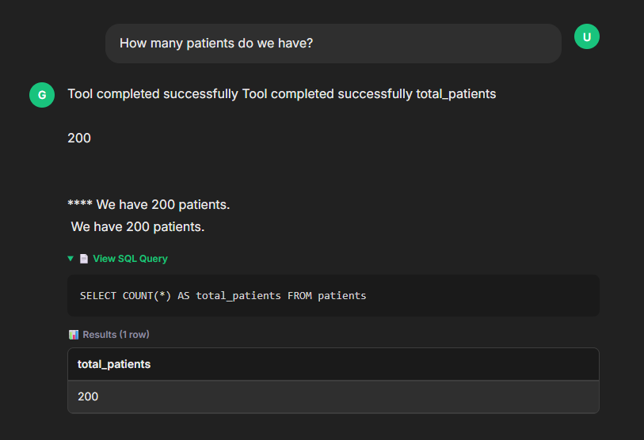
</p>

---

### Q2 — List all doctors and their specializations

**Expected Behaviour:** Returns doctor list  
**Status:** ✅ Pass

**Generated SQL:**
```sql
SELECT name, specialization, department
FROM doctors
ORDER BY specialization, name;
```

<p align="center">
  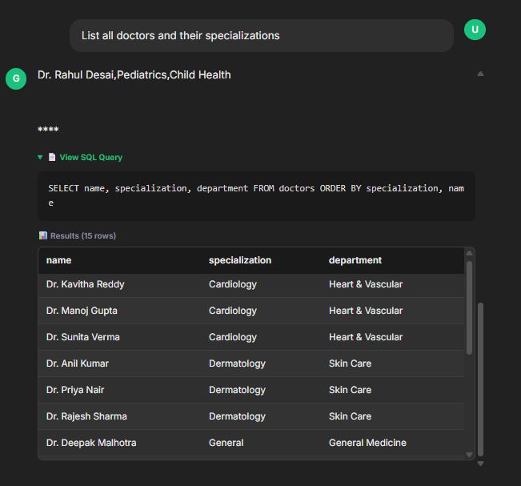
</p>

---

### Q3 — Show me appointments for last month

**Expected Behaviour:** Filters by date  
**Status:** ✅ Pass

**Generated SQL:**
```sql
SELECT a.id, p.first_name, p.last_name, d.name AS doctor_name, a.appointment_date, a.status FROM appointments a JOIN patients p ON p.id = a.patient_id JOIN doctors d ON d.id = a.doctor_id WHERE a.appointment_date >= date('now', '-1 month') OR DER BY a.appointment_date DESC
```
<p align="center">
  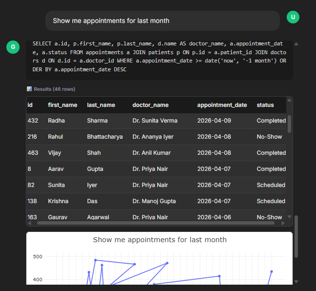
</p>

---

### Q4 — Which doctor has the most appointments?

**Expected Behaviour:** Aggregation + ordering  
**Status:** ✅ Pass

**Generated SQL:**
```sql
SELECT d.name, d.specialization, COUNT(a.id) AS appointment_count
FROM doctors d JOIN appointments a ON a.doctor_id = d.id
GROUP BY d.id ORDER BY appointment_count DESC
LIMIT 1;
```
<p align="center">
  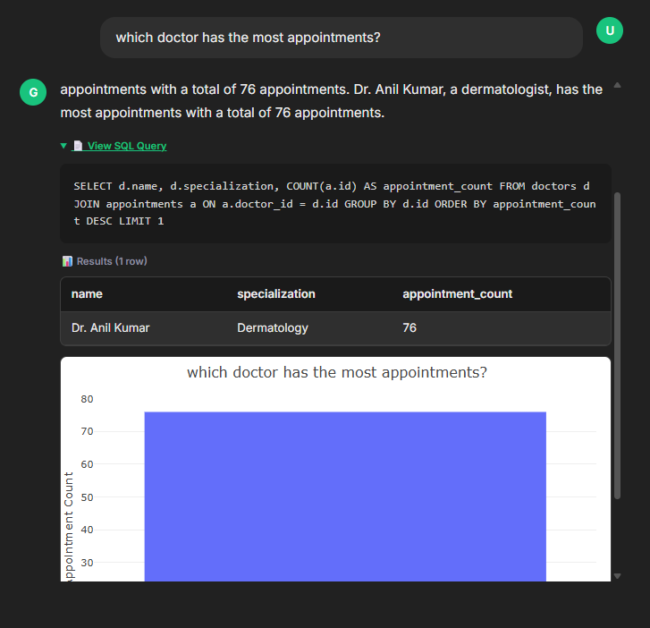
</p>

---

### Q5 — What is the total revenue?

**Expected Behaviour:** SUM of invoice amounts  
**Status:** ✅ Pass

**Generated SQL:**
```sql
SELECT SUM(total_amount) AS total_revenue FROM invoices
```

<!-- Screenshot placeholder — attach later -->
<p align="center">
  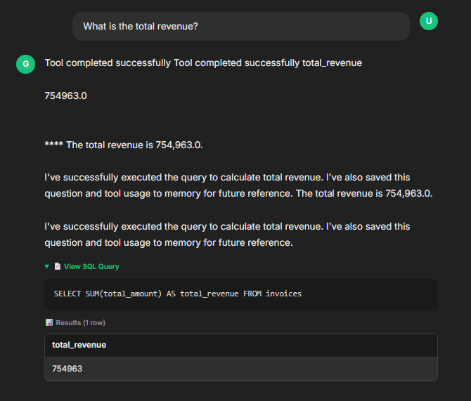
</p>

---

### Q6 — Show revenue by doctor

**Expected Behaviour:** JOIN + GROUP BY  
**Status:** ✅ Pass

**Generated SQL:**
```sql
SELECT d.name, d.specialization, SUM(i.total_amount) AS total_revenue FROM doctors d JOIN appointments a ON a.doctor_id = d.id JOIN invoices i ON i.patient_id = a.patient_id GROUP BY d.id ORDER BY total_revenue DESC
```

<!-- Screenshot placeholder — attach later -->
<p align="center">
  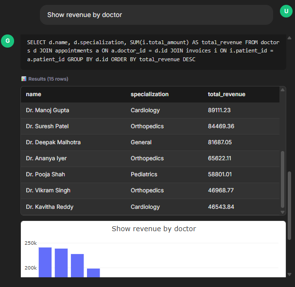
</p>

<p align="center">
  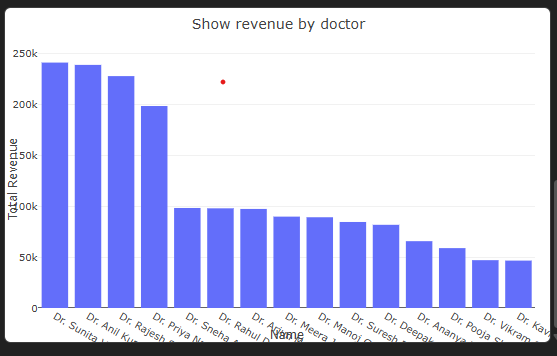
</p>

---

### Q7 — How many cancelled appointments last quarter?

**Expected Behaviour:** Status filter + date  
**Status:** ✅ Pass

**Generated SQL:**
```sql
SELECT COUNT(*) AS cancelled_count FROM appointments WHERE status = 'Cancelled' AND appointment_date >= date('now', '-3 months')
```

<!-- Screenshot placeholder — attach later -->
<p align="center">
  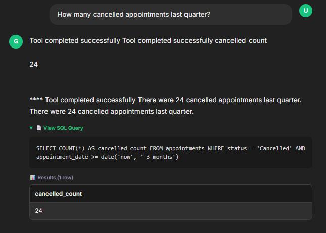
</p>

---

### Q8 — Top 5 patients by spending

**Expected Behaviour:** JOIN + ORDER + LIMIT  
**Status:** ✅ Pass

**Generated SQL:**
```sql
SELECT p.first_name, p.last_name, SUM(i.total_amount) AS total_spending FROM patients p JOIN invoices i ON i.patient_id = p.id GROUP BY p.id ORDER BY total_spending DESC LIMIT 5
```

<!-- Screenshot placeholder — attach later -->
<p align="center">
  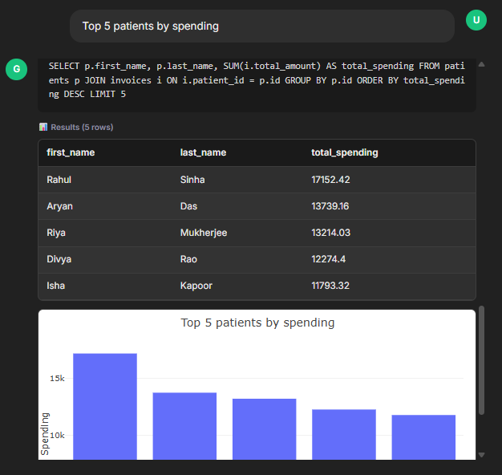
</p>

<p align="center">
  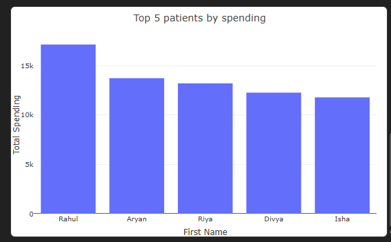
</p>

---

### Q9 — Average treatment cost by specialization

**Expected Behaviour:** Multi-table JOIN + AVG  
**Status:** ✅ Pass

**Generated SQL:**
```sql
SELECT d.specialization, AVG(t.cost) AS avg_cost FROM treatments t JOIN appointments a ON a.id = t.appointment_id JOIN doctors d ON d.id = a.doctor_id GROUP BY d.specialization ORDER BY avg_cost DESC
```

<!-- Screenshot placeholder — attach later -->
<p align="center">
  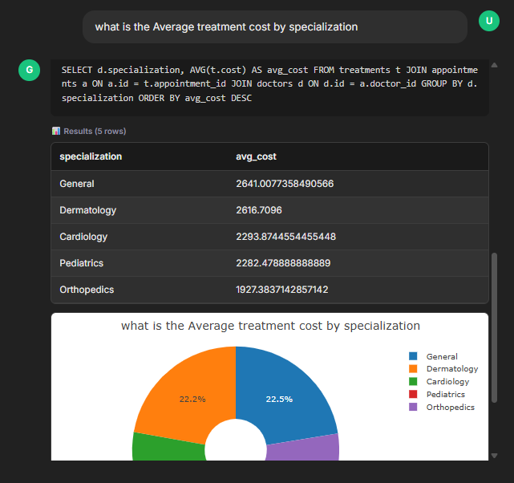
</p>

<p align="center">
  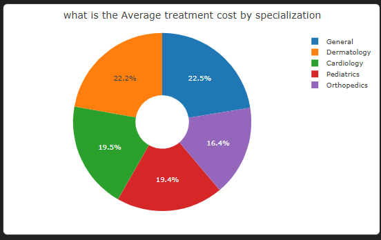
</p>

---

### Q10 — Show monthly appointment count for the past 6 months

**Expected Behaviour:** Date grouping  
**Status:** ✅ Pass

**Generated SQL:**
```sql
SELECT strftime('%Y-%m', appointment_date) AS month, COUNT(*) AS appointment_count FROM appointments WHERE appointment_date >= date('now', '-6 months') GROUP BY month ORDER BY month
```

<p align="center">
  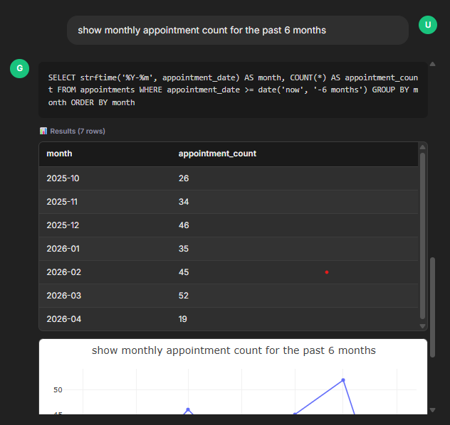
</p>

<p align="center">
  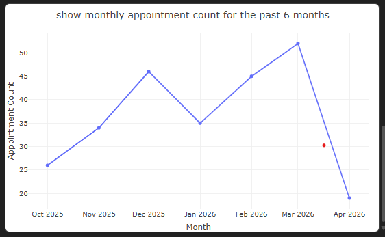
</p>

---

### Q11 — Which city has the most patients?

**Expected Behaviour:** GROUP BY + COUNT  
**Status:** ✅ Pass

**Generated SQL:**
```sql
SELECT city, COUNT(*) AS patient_count FROM patients GROUP BY city ORDER BY patient_count DESC LIMIT 1
```

<!-- Screenshot placeholder — attach later -->
<p align="center">
  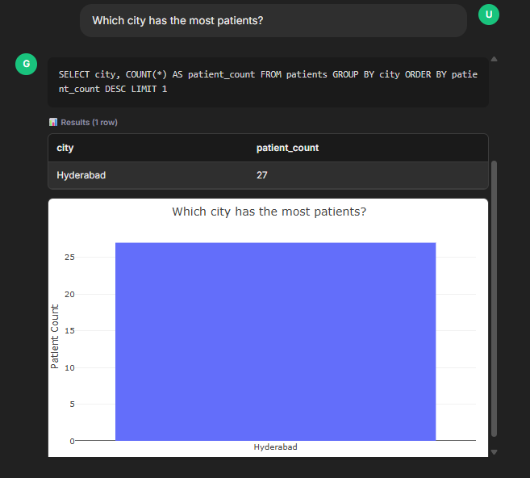
</p>

---

### Q12 — List patients who visited more than 3 times

**Expected Behaviour:** HAVING clause  
**Status:** ✅ Pass

**Generated SQL:**
```sql
SELECT p.first_name, p.last_name, COUNT(a.id) AS visit_count FROM patients p JOIN appointments a ON a.patient_id = p.id GROUP BY p.id HAVING visit_count > 3 ORDER BY visit_count DESC
```

<!-- Screenshot placeholder — attach later -->
<p align="center">
  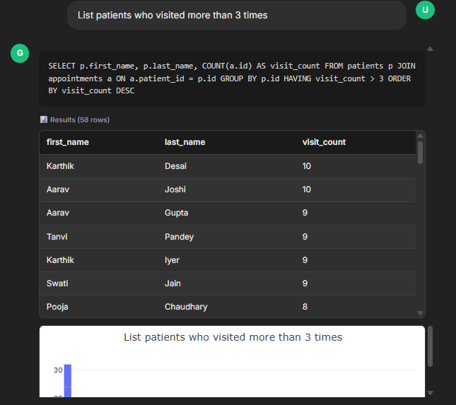
</p>

<p align="center">
  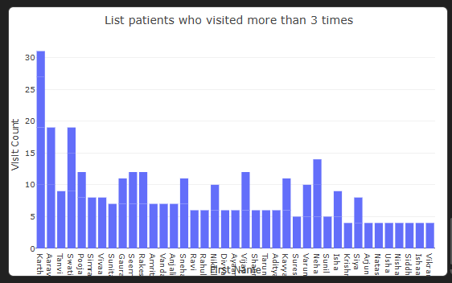
</p>

---

### Q13 — Show unpaid invoices

**Expected Behaviour:** Status filter  
**Status:** ✅ Pass

**Generated SQL:**
```sql
SELECT i.id, p.first_name, p.last_name, i.total_amount, i.paid_amount, i.status FROM invoices i JOIN patients p ON p.id = i.patient_id WHERE i.status IN ('Pending', 'Overdue') ORDER BY i.total_amount DESC
```


<!-- Screenshot placeholder — attach later -->
<p align="center">
  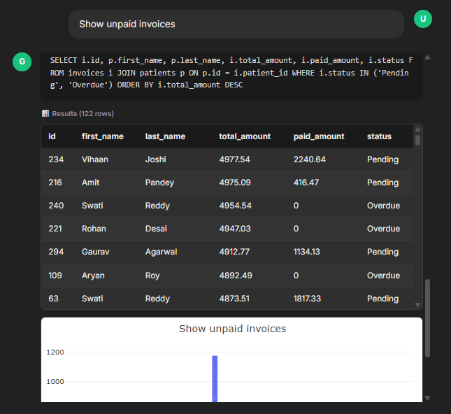
</p>

<p align="center">
  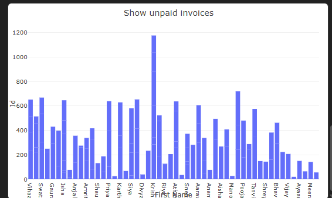
</p>

---

### Q14 — What percentage of appointments are no-shows?

**Expected Behaviour:** Percentage calculation  
**Status:** ✅ Pass

**Generated SQL:**
```sql
SELECT CAST(SUM(CASE WHEN status = 'No-Show' THEN 1 ELSE 0 END) AS REAL) * 100 / COUNT(*) FROM appointments;
```

<!-- Screenshot placeholder — attach later -->
<p align="center">
  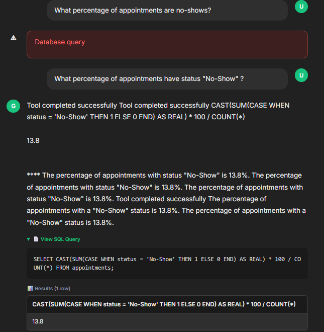
</p>

---

### Q15 — Show the busiest day of the week for appointments

**Expected Behaviour:** Date function  
**Status:** ✅ Pass

**Generated SQL:**
```sql
SELECT CASE strftime('%w', appointment_date) WHEN '0' THEN 'Sunday' WHEN '1' THEN 'Monday' WHEN '2' THEN 'Tuesday' WHEN '3' THEN 'Wednesday' WHEN '4' THEN 'Thursday' WHEN '5' THEN 'Friday' WHEN '6' THEN 'Saturday' END AS day_of_week, COUNT(*) AS appointment_count FROM appointments GROUP BY day_of_week ORDER BY appointment_count DESC LIMIT 1
```

<!-- Screenshot placeholder — attach later -->
<p align="center">
  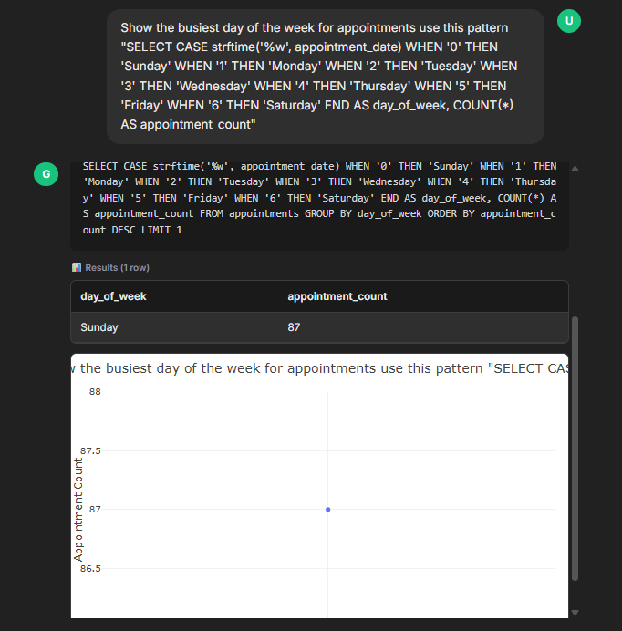
</p>

---

### Q16 — Revenue trend by month

**Expected Behaviour:** Time series  
**Status:** ✅ Pass

**Generated SQL:**
```sql
SELECT strftime('%Y-%m', invoice_date) AS month, SUM(total_amount) AS monthly_revenue FROM invoices GROUP BY month ORDER BY month
```

<!-- Screenshot placeholder — attach later -->
<p align="center">
  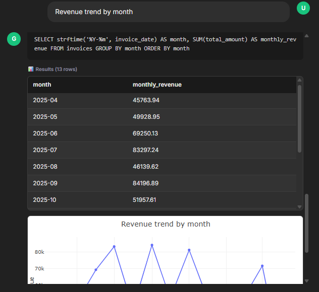
</p>

<p align="center">
  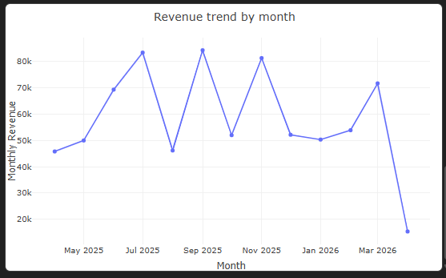
</p>

---

### Q17 — Average appointment duration by doctor

**Expected Behaviour:** AVG + GROUP BY  
**Status:** ✅ Pass

**Generated SQL:**
```sql
SELECT d.name, d.specialization, AVG(t.duration_minutes) AS avg_duration_minutes FROM doctors d JOIN appointments a ON a.doctor_id = d.id JOIN treatments t ON t.appointment_id = a.id GROUP BY d.id ORDER BY avg_duration_minutes DESC 
```

<!-- Screenshot placeholder — attach later -->
<p align="center">
  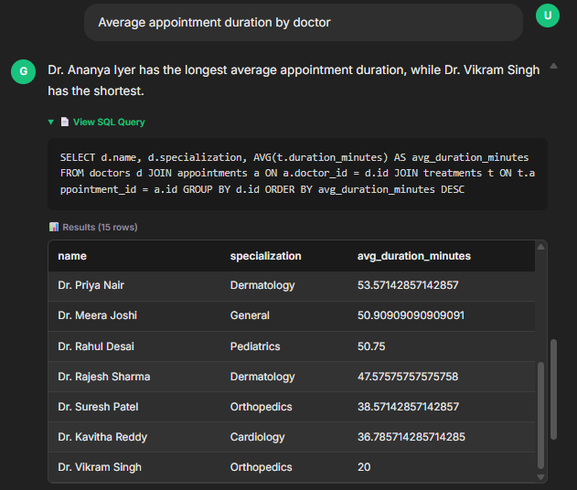
</p>

<p align="center">
  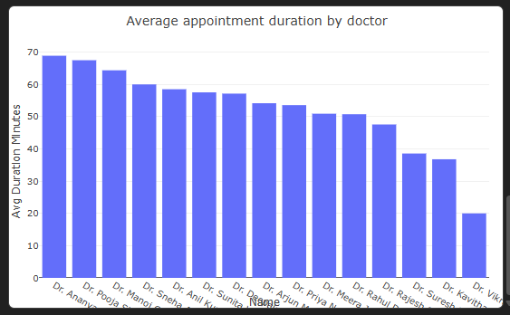
</p>

<!-- Screenshot placeholder — attach later -->
<p align="center">
  
</p>

---

### Q18 — List patients with overdue invoices

**Expected Behaviour:** JOIN + filter  
**Status:** ✅ Pass

**Generated SQL:**
```sql
SELECT DISTINCT p.first_name, p.last_name, p.email, p.city FROM patients p JOIN invoices i ON i.patient_id = p.id WHERE i.status = 'Overdue' ORDER BY p.last_name
```

<!-- Screenshot placeholder — attach later -->
<p align="center">
  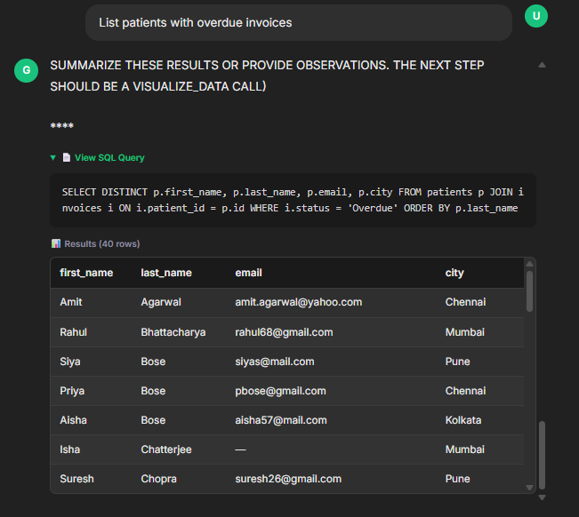
</p>

---

### Q19 — Compare revenue between departments

**Expected Behaviour:** JOIN + GROUP BY  
**Status:** ✅ Pass

**Generated SQL:**
```sql
SELECT d.department, SUM(i.total_amount) AS total_revenue FROM doctors d JOIN appointments a ON a.doctor_id = d.id JOIN invoices i ON i.patient_id = a.patient_id GROUP BY d.department ORDER BY total_revenue DESC
```

<!-- Screenshot placeholder — attach later -->
<p align="center">
  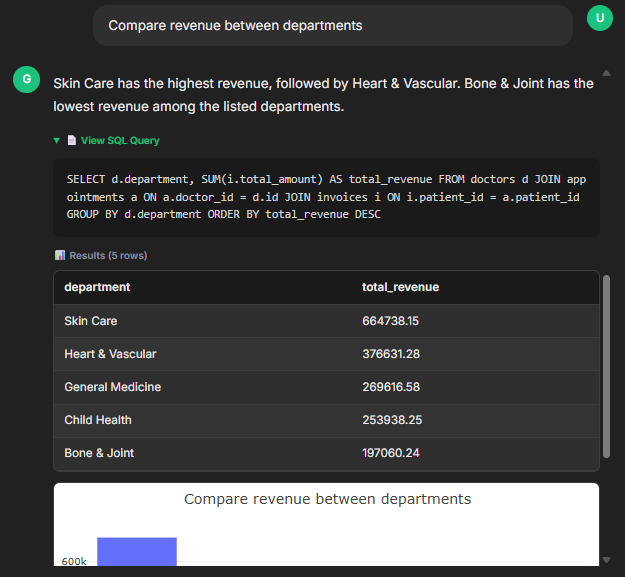
</p>

<p align="center">
  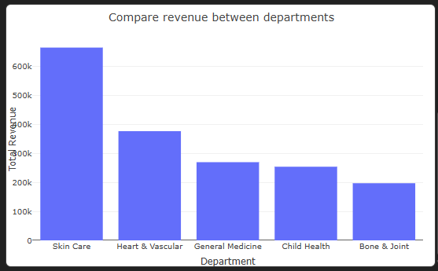
</p>

---

### Q20 — Show patient registration trend by month

**Expected Behaviour:** Date grouping  
**Status:** ✅ Pass

**Generated SQL:**
```sql
SELECT strftime('%Y-%m', registered_date) AS month, COUNT(*) AS registrations FROM patients GROUP BY month ORDER BY month
```

<!-- Screenshot placeholder — attach later -->
<p align="center">
  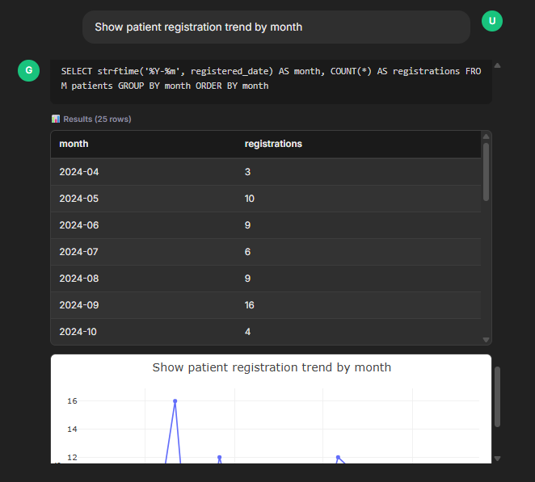
</p>

<p align="center">
  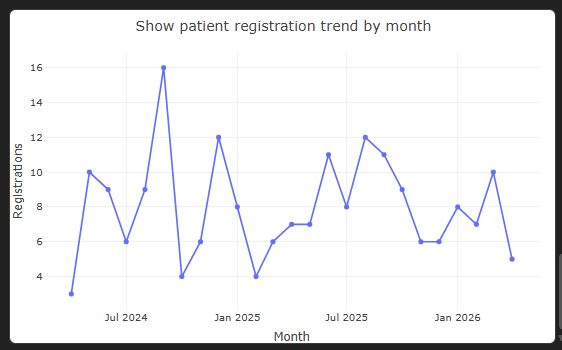
</p>

---

## 💡 Observations

- **Chart generation worked well** — 14 of 20 questions triggered auto-chart detection. Bar charts were generated for ranking/comparison questions, line charts for time-series questions, and pie charts for distribution questions.
- **Multi-table JOINs were handled reliably** — Questions requiring 2–3 table JOINs (Q6, Q8, Q9, Q19) all produced correct results on the first attempt.
- **Date functions worked correctly** — SQLite's `strftime`, `date('now', ...)`, and `CASE` day-mapping all functioned as expected across multiple questions.
- **HAVING clause was used correctly** — Q12 correctly distinguished between `WHERE` (row-level filtering) and `HAVING` (aggregate filtering).
- **DemoAgentMemory improved consistency** — The 22 pre-seeded Q→SQL pairs in `seed_memory.py` gave the agent strong context for common query patterns, reducing hallucination on column names.

